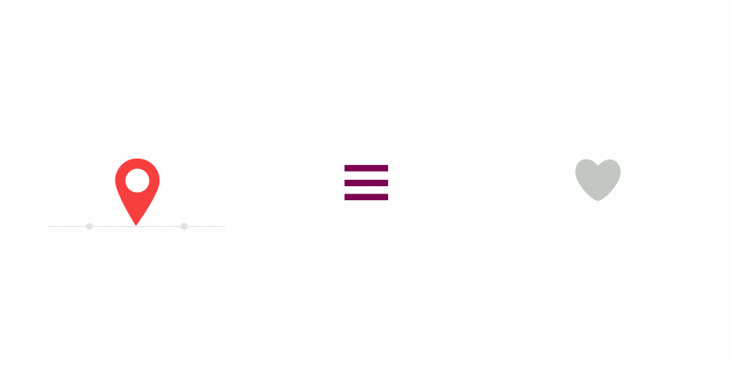
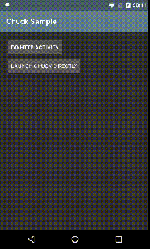

# new

### https://github.com/airbnb/lottie-android
Render After Effects animations natively on Android and iOS, Web, and React Native http://airbnb.io/lottie/

### Chuck

If you use OkHttp , this is the library that helps intercept and persist all HTTP requests and responses inside your application. It also provides a UI for inspecting their content. 

###ObjectBox
https://github.com/objectbox

http://objectbox.io/documentation/

